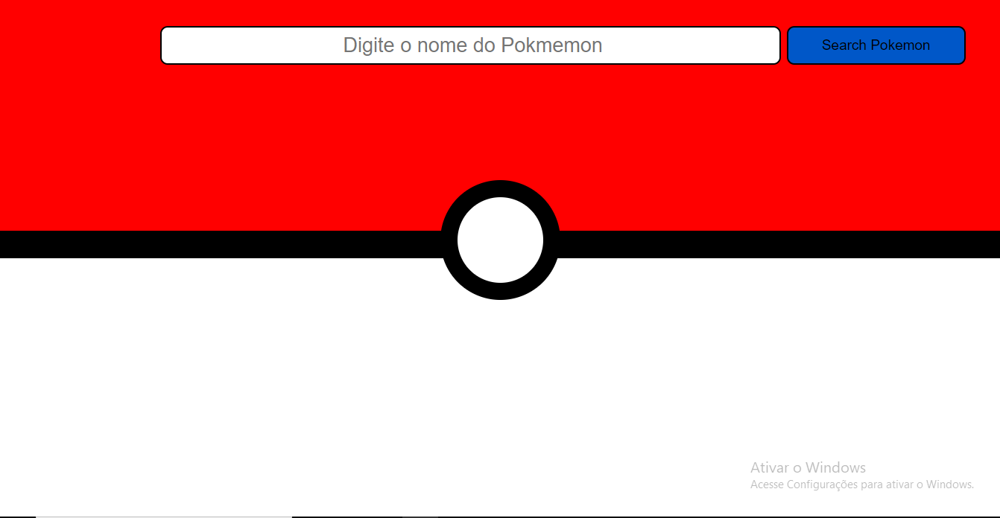
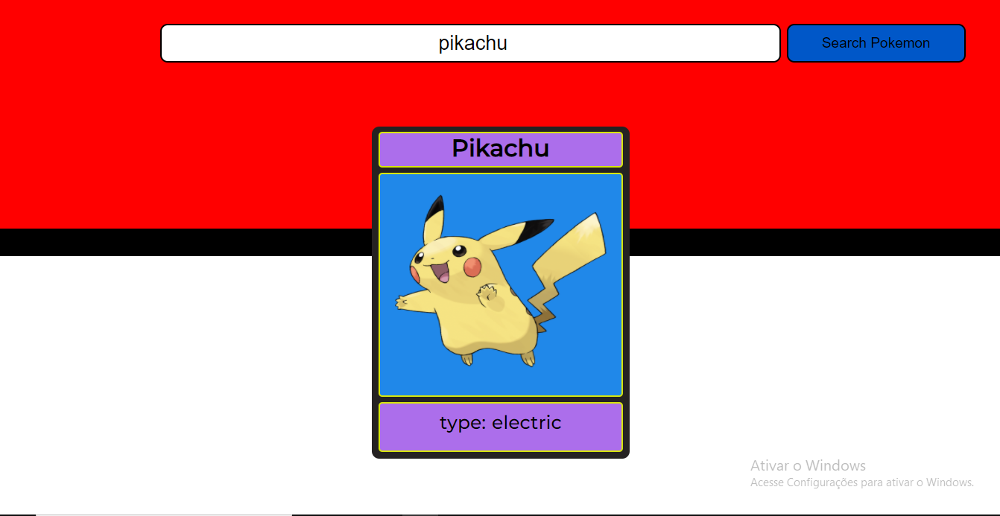

# Buscador de pokemons via fetch API.

<h2>descrição dos pokemons adquiridas em: <a href="https://pokeapi.co/docs/v2">PokeAPI</a>.</h2>
<h2>imagens dos pokemons adquiridas em: <a href="https://pokedevs.gitbook.io/pokedex/resources/pokemon">PokéDex API</a>.</h2> 
<h2>Clique <a href="https://caiouser2.github.io/Buscador-de-pokemons-via-API/
">AQUI </a>para acessar o site.</h2>
